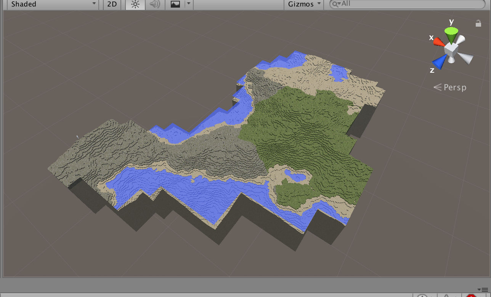

# Minecraft Clone




## Dependencies

### Middlewares/Tools

* Unity: 6000.0.37f1
* ImageMagick
* Ruby
* direnv
* Docker: >= 27.3.1
* docker-compose: >= v2.29.7-desktop.1

### Optional

* gettext
  * for envsubst

### Assets

* [UniRx](https://assetstore.unity.com/packages/tools/integration/unirx-reactive-extensions-for-unity-17276): 7.1.0

## Setup

Execute the following commands on WSL:

```sh
# Set your config
cp .envrc.local.sample .envrc.local
vi .envrc.local
direnv allow .

# Activation
unity -createManualActivationFile

## Upload the manual activation file on https://license.unity3d.com/manual
unity -manualLicenseFile ${ULF_FILE}

# Import Assets
unity -executeMethod ImportAssets.Import

# Generate Texture
generate_texture
```

## Development

### Unity batch commands

```sh
# Create activation file
unity -createManualActivationFile

# Create activation file(for docker/CI)
unity -createManualActivationFile -username <email> -password <password>

# Activation
unity -manualLicenseFile ${ULF_FILE}

# Import assets
unity -executeMethod ImportAssets.Import /basePath /path/to/assets

# Build app
unity -executeMethod Builder.BuildWebGL
```

### WebGL

```sh
# Build docker image
docker compose build

# Build WebGL app
unity -executeMethod Builder.BuildWebGL

# Boot WebGL app
docker compose up
```

### Deploy to Firebase

```sh
make_firebaserc
firebase deploy
```

## Documentation

* [Minecraft clone design | mrk21 Kibela](https://mrk21.kibe.la/shared/entries/3d340747-4142-4568-9d78-d0ce494ca9d7)
* [Minecraft clone memo | mrk21 Kibela](https://mrk21.kibe.la/shared/entries/294c5ea1-70db-40ca-a455-7f3266158789)
* [【Unity】Unityでメモリリーク発生？原因と調査方法について – 株式会社ロジカルビート](https://logicalbeat.jp/blog/15426/)
* [UnityのPersonalライセンスで.ulfファイルをダウンロードする方法(2024/6時点）](https://zenn.dev/hirosukekayaba/articles/067693ad146d18)
